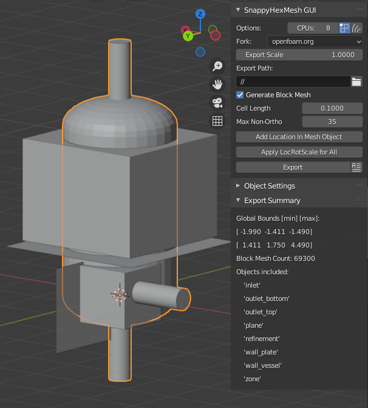
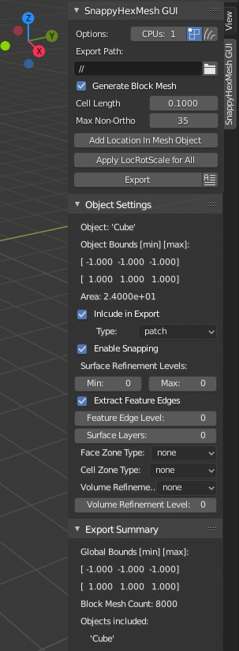
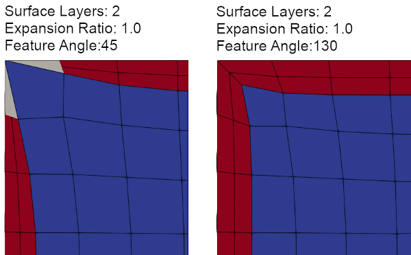
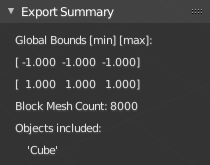

SnappyHexMesh GUI Addon for Blender
===================================

Introduction
------------

This add-on turns `Blender <https://www.blender.org>`_
into a GUI for
`SnappyHexMesh <https://openfoamwiki.net/index.php/SnappyHexMesh>`_,
a volume mesh generation tool for
OpenFOAM®, the open source CFD (computational fluid dynamics) toolbox.
The add-on exports a complete OpenFOAM case folder structure, with
geometry and dictionary files, ready to run OpenFOAM commands
including *snappyHexMesh*. The aim of the add-on is to

* Ease the workflow for importing, updating, modifying and exporting
  3D surface meshes to OpenFOAM.
* Allow definition of most common SnappyHexMesh settings via Blender
  GUI, to reduce need for manual modification of OpenFOAM dictionary
  definitions.
* Require minimal Blender skills. Geometry can be modelled in any 3D
  modelling / CAD program which exports a surface mesh format that can
  be imported to Blender, such as STL or Wavefront OBJ.

The add-on generates OpenFOAM dictionary files for the surface mesh
objects in Blender. Dictionary creation is based on string
replacements using template files located in the
add-on's *skel* directory. The add-on is meant to work on
`latest LTS release of Blender <https://www.blender.org/download/LTS/>`_
and latest stable
`OpenFOAM.com <https://www.openfoam.com/>`_ and
`OpenFOAM.org <https://openfoam.org/>`_
versions of OpenFOAM.
Tested with Blender 3.6.

To learn to use SnappyHexMesh GUI, have a look at my video tutorial series
`Blender for OpenFOAM users <http://tkeskita.kapsi.fi/blender/>`_.

Reasons to use SnappyHexMesh GUI
--------------------------------

SnappyHexMesh GUI is beneficial for both SnappyHexMesh beginners and
experienced users:

* For beginners, the GUI helps by providing only the most important
  settings, without any need to know dictionary file details.
* For experienced users, the GUI removes the needs to edit the various
  dictionary files (avoid typos and logic mistakes!) and to provide
  point coordinates manually.
* The possibility to do visual inspection while setting up meshing
  reduces setup mistakes.
* Use of one point of input (the GUI) for all settings and case
  clean-up decreases risk of setup errors, outdated intermediate files
  and missing commands. It also allows step-wise fast iteration of the
  mesh generation workflow, which speeds up mesh generation work, as
  the shortcomings of the mesh are exposed early.
* Debugging time for fixing mesh generation issues is decreased,
  since the GUI decreases the complexity of the process.
* The GUI provides a well-tested and consistent starting point for the
  numerous SnappyHexMesh settings, which should work fairly well for
  many cases out-of-box.

Current Status and Features
---------------------------

Currently implemented features include:

* Creation of basic OpenFOAM case structure, including export of
  dictionary files (most importantly *snappyHexMeshDict*) and surface
  meshes as STL files
* Automatic creation of *blockMeshDict* with cell size as a parameter
* Calculation of cell count for the resulting block mesh
* Definition of surface refinement levels for surfaces
* Creation of feature edge definition (*surfaceFeatureExtractDict* or *surfaceFeaturesDict*)
* Definition of surface layers for surfaces
* Creation of face zones and cell zones from surfaces
* Volume refinement using surface meshes enclosing a volume

Limitations of SnappyHexMesh
----------------------------

To get a mesh with wanted features, the user is required to
understand many of the features and limitations of SnappyHexMesh. Some
of those include:

* **SnappyHexMesh is a very complex automatic mesh generation tool**,
  with more than 50 settings available for the user to modify. The
  effect of changing a parameter value often depends on the value of
  many other parameters, as well as the case geometry (see
  https://github.com/tkeskita/snappyLayerTests/blob/main/test_result_analysis.md
  for some variation test results). This means that the combination of
  the 50+ parameter values plays a major role for the result. Not just
  any combination taken from tutorials results in a "good" mesh (also,
  you define what is good).
* **OpenFOAM fork and version of SnappyHexMesh can play a major role** for the
  results. The current default fork is *openfoam.com*, due to it's improved
  snapping and layer addition features.
* **Surface mesh quality is important**. Surface meshes exported from
  3D CAD tools are typically "dirty" (contain quality issues or outright
  errors). If surface mesh has issues, then the resulting mesh likely
  has issues, e.g. snapping problems arise.
* **Mesh quality and snapping/layer addition quality are
  interdependent**. Too strict requirements for mesh quality (the
  settings in *meshQualityDict*) will lead to decrease in snapping
  quality and decrecrease in layer coverage. A "good" balance is often
  hard to achieve, and you often need to settle with a compromise.
* **A good coverage for layer addition with SnappyHexMesh is possible,
  but it has several prerequisites**

  * Enough volume above boundary surfaces to displace (squash) the
    base mesh cells and to add the layer cells. Total thickness of
    layers needs to fit in.
  * Enough refinement level (small enough cells) near curving surfaces.
  * Low curvature in locations where refinement level (cell size)
    changes.

* **SnappyHexMesh works best with cubic background mesh** extending
  over all of the geometry bounds.
* **Provide meshes/definitions for ALL boundary surfaces** for
  SnappyHexMesh, otherwise snapping may not work properly.
* **Good snapping to sharp edges (feature edge snapping)** depends on
  snapping settings and mesh quality settings. Edge meshes should be
  provided only for those edges for which snapping is wanted, to avoid
  misplaced snapping.
* Always check the resulting mesh with `checkMesh` and review it
  visually in Paraview before you apply the mesh in your application.

Installation and Start-up
-------------------------

* Add-on is supported for newest LTS version of Blender,
  `download Blender LTS version here <https://www.blender.org/download/LTS/>`_.
* Add-on code is available at https://github.com/tkeskita/snappyhexmesh_gui
  --> Code --> Download zip.
* Start Blender, go to "Edit" --> "Preferences" --> "Add-ons" --> "Install"
  --> open the add-on zip file.
* Activate the "SnappyHexMesh GUI" add-on in Preferences.
  Add-on is located in Object category of Blender add-ons.

Add-on visibility
-----------------

Add-on is visible in Blender's 3D Viewport in Sidebar as a separate
Sidebar tab in Object Mode. To view the add-on panels, you must

  * Select a mesh object (in 3D Viewport or in Outliner)
  * View Sidebar ("View" --> "Toggle Sidebar" or press "N" key in 3D Viewport)
  * Select "SnappyHexMesh GUI" tab in the Sidebar

Quickstart
----------

* Create surface meshes in any suitable 3D modelling tool and export
  in STL/OBJ format
* Import meshes to Blender ("File" --> "Import")
  or model geometry directly in Blender
* Adjust the add-on settings per object in Blender
* Save Blender file to an empty case folder
* Click **Export** button in the add-on to create OpenFOAM directories
  and files under the case folder

After export from Blender, start a terminal and source OpenFOAM in the
terminal (unless it is automatically sourced e.g. in your
`~/.bashrc` file). You should be able to run the ``./run`` bash script
generated by the add-on in the case folder. Alternatively, you can run
the OpenFOAM commands manually in the case folder in order:

* ``blockMesh``
* ``surfaceFeatureExtract`` (for openfoam.com version of OpenFOAM) or
  ``surfaceFeatures`` (for openfoam.org version of OpenFOAM)
* ``snappyHexMesh``
* ``checkMesh``
* Optionally run ``postProcess -time '1:'`` to generate cell center coordinate and cell volume fields

You can view the final mesh using `Paraview <https://www.paraview.org>`_.

Iterative Workflow
------------------

Here is an example iterative workflow for working the whole mesh
creation pipeline in a case folder. Meshing and reviewing the results
is fastest when you start with a fairly large block mesh *Cell
Length*, and tune only a few settings in the GUI at a time.

* Clean up case folder by clicking on the **Clean Case Dir** button, or run the commands in terminal: ``rm -rf 1 2 3 constant system processor* log.*``
* Make modifications in Blender, save file, and click the add-on **Export** button
* Run the ``./run`` bash script, or the manual OpenFOAM terminal commands: ``blockMesh; surfaceFeatureExtract; snappyHexMesh``
* Refresh Paraview to see updated mesh

Always check that the final mesh has correct scale, rotation and location.

Panels and Settings
-------------------

SnappyHexMesh GUI consists of three main Panels: SnappyHexMesh GUI
(top panel), Object Settings (middle panel) and Export Summary (bottom
panel). By default all panels are expanded.

SnappyHexMesh GUI Panel
^^^^^^^^^^^^^^^^^^^^^^^

This panel contains overall settings and tool buttons.
You can hover mouse cursor over fields to see tool tips for more
information.

General Settings
................

* *Options* with CPU count and toggle icons:

  * *CPUs* specifies the number of cores for *decomposeParDict*
    (*scotch* decomposition method is the default for *decomposePar*)
  * *Do Castellation Phase*
  * *Do Snapping Phase*
  * *Do Layer Addition Phase*

* *Export Scale* is an optional scaling factor for STL geometry
  files and convertToMeters in blockMeshDict.
* *Fork* defines the fork of OpenFOAM for compatibility of generated files.
  Currently it only defines whether to produce *surfaceFeaturesDict*
  (for openfoam.org) or *surfaceFeatureExtractDict* (for
  openfoam.com).
* *Export path* defines path name where the add-on creates the OpenFOAM
  case files when the Export tool is run. The default value "//" means
  that the case folder is the same folder where Blender file is saved.
* *Generate Block Mesh* indicates that blockMeshDict is to be generated
  during export using *Cell Length* as a measure for cubical cell sides.
* *Cell Length* is the target length for the block mesh cube side,
  which will be created after export by running the OpenFOAM command
  *blockMesh*.

.. tip::

  SnappyHexMesh works best when the **surfaces of the geometry are
  aligned / colocated with** the internal faces of **the base block
  mesh**.  Select *Cell Length* value accordingly and/or move the
  geometry surfaces to achieve alignment / colocation / overlap, if
  possible.

  .. figure:: images/block_mesh_alignment.png

Quality Criteria
................

* *Disable All Quality Criteria* uses such values for the
  *meshQualityDict* parameters that all quality checks made by
  *snappyHexMesh* pass. The resulting mesh is maximally snapped and
  layered, so this option is useful for testing that surface meshes,
  refinements and feature edges applied in a case work well for
  Snappy. With this option enabled, you can see what Snappy is able to
  create when it is allowed to create maximally bad cells. However,
  since the quality of such a mesh for numerical solution can be
  extremely poor, the use of the mesh with a solver typically
  fails. That is the reason to have quality parameters, and it also
  means that **practically always there is a compromise between
  the numerical quality of the mesh and the quality of snapping/layering**.

  Note that mesh quality parameters below are hidden when this option
  is enabled. A warning text above *Export* button appears when this
  option is enabled.

* *Max Non-Ortho* is the volume mesh quality measure for maximum
  non-orthogonality for SnappyHexMesh.

.. note::

  *Max Non-Ortho* may be the most important mesh quality parameter. A small
  value produces mesh that is good for the numerical solution of flow
  equations. However, a small value restricts snapping and addition of
  surface layers. Meanwhile, a large value yields a mesh that snaps to
  surfaces better and allows better surface layer coverage, but the
  mesh may cause numerical issues for some solvers. The current
  default setup uses a small value (35) for the snapping phase, and a
  large value (75) for the *Relaxed Max Non-Ortho* option applied in
  the layer addition phase.

* *Min Triangle Twist* defines a minimum allowed value for twist of cell
  faces.

.. note::

  *Min Triangle Twist* is another important mesh quality parameter in
  practice. A value close to one will produce flat faces, at the cost
  of worse snapping. Values below one allow creation of
  twisted faces, which may cause numerical issues for some solvers. The
  default value 0.6 allows for some twisting, so if the resulting mesh
  exhibits numerical issues, try to increase this value.

Layer Addition Global Options
.............................

These options are visible only if *Do Layer Addition Phase* option is
enabled.

.. warning::

   Addition of layers may create a mesh which causes numerical issues
   for some solvers.

* *Relaxed Max Non-Ortho* is the maximum non-orthogonality applied only
  for the Layer Addition phase.
* *Feature Angle* defines the edge angle for feature detection. When
  angle is larger than this value, layers are collapsed (removed) at
  the edge. This affects layer building near corners. A large value
  creates layers which fill sharp corners, while a low value removes
  layers near corners.

* *Expansion Ratio* is the ratio of layer target thicknesses. Value larger than
  one will result in increasing layer thickness (from walls inwards).
* *Final Thickness* is the relative ratio of the final layer thickness
  to the base cell side length.
* *Min Thickness* is the minimum accepted relative layer thickness for
  any layer.

.. tip::

  Layer addition seems to work better with openfoam.com version of
  *snappyHexMesh* than with the openfoam.org version. For openfoam.org
  version, you can try to add layers incrementally, only two layers at
  a time. To do that, disable *Do Castellation Phase* and
  *Do Snapping Phase* options, modify the *Final Thickness* and
  *Min Thickness* parameters, *Export*, and then run *snappyHexMesh*
  again.

Operators
.........

The panel buttons launch the following operators:

* **Apply LocRotScale For All** resets the Object Transformation
  Properties (Location, Rotation and Scale) of all mesh objects to
  default values. This makes measurement values always unambiguous,
  regardless of whether you have the Local or Global Value option
  enabled. It is suggested to run this tool before mesh modifications
  to avoid possibility of accidentally inputting wrong values.
* **Clean Mesh** is a simple mesh cleaning operator, meant for
  rudimentary CAD mesh clean up. The operator goes through every selected mesh
  object. It merges vertices which are located closer than the *Merge
  Distance* option value given on the right side of the button. The
  operator also recalculates outward surface normals for all
  meshes. Number of merged vertices per object is given as return info
  from the operator. Note: Object scaling may affect the result.
  It is suggested to run *Apply LocRotScale For All* before running this operation.
* **Add Location In Mesh Object** will add an Empty object named like
  *Location In Mesh region0* to Blender scene. The *region0* part in the
  object name is the name of the region (the default region name when
  the mesh contains only one mesh region is *region0*). If only one
  *Location In Mesh* empty object exists, the coordinates of this object
  is applied to specify the *LocationInMesh* coordinates. If no
  *Location In Mesh* empty objects exist, zero coordinates are used for
  *LocationInMesh*. If several such objects exist, then a list of
  object locations and names are exported to *LocationsInMesh*
  (openfoam.com option for multi-region meshing) section of snappyHexMeshDict.
* **Clean Case Dir** command removes directory names *1-9, constant*,
  *system* and *processor\** if they exist in the *Export path*. This
  effectively cleans up the case folder from any lingering OpenFOAM
  files, so that after running *Export*, the case folder should
  contain only fresh files, ready for OpenFOAM.
* **Export** tool creates and saves the OpenFOAM case files under
  *Export path* using the overall settings in this panel and Object
  Settings for each mesh object included in the export.
* If *ASCII STL* icon on right of *Export* tool is enabled, the STL
  files are written in ASCII text format instead of binary STL format.

Object Settings Panel
^^^^^^^^^^^^^^^^^^^^^

This panel shows settings for the active (selected) mesh object.
The panel top part shows information about the object. These
information are also added as comments in snappyHexMeshDict upon
export.

* *Object* row shows the name of the active object.
* **Copy Settings to Objects** tool copies the SnappyHexMesh GUI
  settings from *the active object* (the last selected object) to all other *selected mesh
  objects*. This allows mass modification of SnappyHexMesh settings
  when dealing with numerous objects.
* *Object Bounds [min] [max]* shows the minimum and maximum
  coordinates of two box corners which span the volume included
  by the mesh object (bounding box).
* *Area* shows the summed surface area of all faces included in the
  object. **Warning:** Includes mesh errors, like overlapping faces, if
  there are any.

Object Settings
...............

Rest of the panel includes object settings:

* *Include in Export* check box is used to mark which mesh objects are
  to be included in export.
* *Type* specifies the OpenFOAM patch type for this object.
* *Enable Snapping* check box marks inclusion/exclusion of this object
  for SnappyHexMesh snapping phase.
* *Surface Refinement Levels*, *Min* and *Max* specify the minimum and
  maximum level of cell refinements made next to the surfaces of this
  object.
* *Extract Feature Edges* check box marks whether Feature Edges (sharp
  edges) are to be extracted into eMesh format from this object (done
  by running the *surfaceFeatureExtract* or *surfaceFeatures* OpenFOAM
  utility).  If Feature Edges are extracted, then they are also
  assumed to be included for Feature Edge Snapping in SnappyHexMesh.
* *Feature Edge Level* defines a separate cell refinement level for
  Feature Edges.
* *Face Zone Type* decides the type of face zones that are to be
  created for surface:

  * **none**: No face zone or cell zone are to be created.
  * **internal**: Face zone is created with internal faces (each face
    is shared by two cells). The face zone is additionally added to
    *createBafflesDict*, just in case you want to run *createBaffles*
    later on to separate internal face zone into baffles.
  * **baffle**: Face zone is created as baffles (overlapping unshared
    boundary faces).
  * **boundary**: Face zone is created as boundaries (unshared boundary
    faces).

.. tip::

  For **internal thin walls** (for which you don't need to resolve the
  actual thickness), provide the geometry for no wall thickness, and
  use the **baffle** Face Zone Type to create those walls. This
  improves the snapping compared to treating the thin walls as normal
  walls.

**Note:** Face zone name is same as object name.

* *Cell Zone Type* defines the type of cell zones in relation to
  surface mesh, which is assumed to define a manifold surface which
  closes a volume:

  * none: No cell zone is to be created.
  * inside: Inside of the closed volume is to be included in cell zone.
  * outside: Outside of the closed volume is to be included in cell zone.

  **Note:** Cell zone name is same as object name.
  
  **Note 2:** Creation of a cell zone requires that face zone is also created
  for the same object.

* *Volume Refinement* specifies that some cells are to be refined accordingly:

  * none: No refinement.
  * inside: Cells inside of the closed volume are to be refined.
  * outside: Cells outside of the closed volume are to be refined.

* *Volume Refinement Level* shows the number of refinements for volume refinement.

.. tip::

  For **refinement volume objects**, the typical settings
  are: *Type:* patch, *Enable Snapping:* disabled, *Extract Feature Edges:*
  disabled, and *Volume Refinement*: inside.

Object Layer Settings
.....................

The following Layer Addition Settings are visible only if
*Do Layer Addition Phase* option is enabled.

* *Dict File Number* decides which *snappyHexMeshDict* file this
  Object will be added for layer addition. Value 1 means that layers
  for this Object surfaces will be specified in the default
  *snappyHexMeshDict* file. Values larger than one will create
  additional *snappyHexMeshDictX* files, where *X* is the *Dict File
  Number*. This allows additional layers to be added with consequent
  runs after the main ``snappyHexMesh`` run, by commands like
  ``snappyHexMesh -dict system/snappyHexMeshDict2``. This is useful
  for creating intersecting layer patterns. In the cube example below,
  all three opposite cube face pairs have been separated, and layered
  in three separate *snappyHexMesh* runs. **Warning:** This
  sequential layer addition may create very bad cells, always check
  the result!

  .. image:: images/shmg_intersecting_layers_on_a_cube.png

* *Surface Layers* specifies the number of surface layers that are to
  be added to surfaces of this Object. Addition of surface layers
  requires that the *Do Layer Addition Phase* option (icon at GUI top)
  is activated. Default value -1 means that no surface layers are
  specified. Value zero means that no layers are allowed.
* *Slave Side Layers* is relevant only for Face Zones of type Baffle
  or Boundary. It creates layer specification also for the backside of
  the face zone.
* *Object Specific Layer Settings* allows optional definition of
  different layer addition settings for an object, instead of using
  the global options. The object specific settings are the same as the
  global settings described above: *Expansion Ratio*, *Final
  Thickness* and *Min Thickness*.

Export Summary Panel
^^^^^^^^^^^^^^^^^^^^

This panel summarizes the overall properties of export.

* *Global Bounds [min] [max]* shows the minimum and maximum
  coordinates of the bounding box for all mesh objects included in the
  export.
* *Block Mesh Count* is an estimate for the number of cubic cells in
  the background block mesh which covers the Global Bounds using cube
  side length specified in *Cell Length* parameter. The block mesh is
  to be created by running OpenFOAM command *blockMesh*. Note that the
  block mesh contains one extra layer of cells around Global Bounds to
  force the *world* boundary (the block mesh outer patches) not to
  overlap with any geometry surfaces.
* *Objects included* lists all the mesh objects in Blender file, which
  will be exported when *Export* tool is run.
  
Example and tutorial links
--------------------------

A vessel example is located in the add-on's *example* folder called
*vessel.blend*, which showcases some of the features.

   Vessel geometry, wall, zone and refinement volumes in surface mesh format viewed in `Blender`_

.. figure:: images/example_mesh_result.png

   Resulting volume mesh with selected mesh details viewed in `Paraview`_

- I made a tutorial video series `Blender for OpenFOAM users
  <http://tkeskita.kapsi.fi/blender/>`_ which has one tutorial for
  using SnappyHexMesh GUI

- A `Youtube tutorial illustrating the use of SnappyHexMesh GUI
  <https://www.youtube.com/watch?v=9XuDQOAPSL0>`_ (by
  `DaveyGravy <https://www.youtube.com/@daveygravy1207>`_,
  check also the other OpenFOAM related tutorial videos!).

Help and Feedback
-----------------

You are free to file bug reports, ask and give advice by using
`GitHub issues feature
<https://github.com/tkeskita/snappyhexmesh_gui/issues>`_.
Before asking, please try to see and run the vessel example (see
above) to make sure it works for you as expected. Also, please check
the FAQ section below.

Please provide a Blender file (no need to include anything else) with
a small example to illustrate your problem and describe the
issue. Please specify which OpenFOAM variant and version you use.

If you use this add-on, please star the project in GitHub!

FAQ
---

Q: Why is my inlet/outlet/other patch cells malformed / big / not created?
^^^^^^^^^^^^^^^^^^^^^^^^^^^^^^^^^^^^^^^^^^^^^^^^^^^^^^^^^^^^^^^^^^^^^^^^^^

A: Your inlet/outlet/other patch does not coincide with (internal)
faces of the cells of the base block mesh. You may also need to apply
a sufficient level of refinement.

Q: I'm getting refinement in unexpected locations, or weird results
^^^^^^^^^^^^^^^^^^^^^^^^^^^^^^^^^^^^^^^^^^^^^^^^^^^^^^^^^^^^^^^^^^^

A: Is your geometry aligned / colocated with base block mesh as much as possible?
If yes, then your surface mesh might include errors which are so bad
that even SnappyHexMesh is confused by them. Try to run the **Clean
Mesh** operator and see if it helps.
For more advanced CAD surface mesh clean-up and mesh
healing, have a look at my tutorial videos
`Blender for OpenFOAM users <http://tkeskita.kapsi.fi/blender/>`_.

Q: Why are some cell zones missing or wrong?
^^^^^^^^^^^^^^^^^^^^^^^^^^^^^^^^^^^^^^^^^^^^

A: Face normals are not consistent, or they are flipped. To fix face
normals, go to Edit Mode, select everything, and then run Mesh ->
Normals -> Recalculate Outside or Recalculate Inside, depending on
which side of the mesh surface is meant to be "inside" of the cell
zone.

For openfoam.com version, cell zone surfaces should enclose the whole
cell zone volume, while openfoam.org version needs only the surfaces
separating the cell zone from outside. See OpenFOAM tutorial
`heatTransfer/chtMultiRegionFoam/shellAndTubeHeatExchanger` for an example.

Tip: You can enable Face Orientation Overlay in Blender to visualize face
normal direction by color. Red color means that "inside direction" is
towards you, and blue color means that the "outside direction"
(the face normal direction) is towards you.

Q: Why does a surface include faces in two different patches or face zones?
^^^^^^^^^^^^^^^^^^^^^^^^^^^^^^^^^^^^^^^^^^^^^^^^^^^^^^^^^^^^^^^^^^^^^^^^^^^

A: Your case probably includes overlapping surfaces in two different
mesh objects. Remove the overlapping surfaces.

Q: Why is there a world patch in the final mesh? / Why is my mesh leaking?
^^^^^^^^^^^^^^^^^^^^^^^^^^^^^^^^^^^^^^^^^^^^^^^^^^^^^^^^^^^^^^^^^^^^^^^^^^

A: You must always include a set of surfaces (in one or more mesh
objects) which define the outer boundaries of your
computational domain volume. Having a *world* patch in the final mesh
is an indication that your outer surface mesh is "leaking" (the final
mesh is extending outside the surfaces which should define the domain
volume). Leaking may also occur so that mesh extends inside surfaces
that define a volume object located inside the domain.
Leaking may be due to:

* Missing surfaces (holes in surface mesh).
* Big enough cracks (openings) exist in the edges between surfaces.
* *Enable Snapping* option is disabled for an object
* You may need to *Add Location In Mesh Object* to specify a point
  which is inside the mesh domain (otherwise it is assumed that origin
  is inside).
* Model is too far away from origin. Since Blender uses single
  precision floats and OpenFOAM uses double precision, it may help to
  move the model close to origin.

To find out the locations which are leaking, you must add a temporary
additional surface object (e.g. a cube or a plane) around model parts to
see where leaking stops.

Q: Why is final mesh scale/rotation/placement wrong?
^^^^^^^^^^^^^^^^^^^^^^^^^^^^^^^^^^^^^^^^^^^^^^^^^^^^

A: Likely because Object Location/Rotation/Scale is wrong for some
object. If you need to do any movement/rotation/scaling when you
import your surface meshes into Blender to get the end result correct,
then it is good idea to use the *Apply LocRotScale for All*
operator/button to reset the Object scale, rotation and location
before continuing. If you don't do this, then the measures shown in
Blender can be affected by the Object transformations, depending on
whether you have Global or Local value mode on.

Q: Cannot find file when extracting surface features
^^^^^^^^^^^^^^^^^^^^^^^^^^^^^^^^^^^^^^^^^^^^^^^^^^^^

If `surfaceFeatures` (for openfoam.org) or `surfaceFeatureExtract`
(for openfoam.com) command complains about cannot find file, make sure
that the Fork setting at GUI top is correct.

Q: Layer addition crashes/segfaults on writeLayerSets
^^^^^^^^^^^^^^^^^^^^^^^^^^^^^^^^^^^^^^^^^^^^^^^^^^^^^

A: If you get Segmentation fault (core dumped) with the following kind of
error message, it means that the layer addition failed to add any
layer cells. The crash seems to happen when snappy tries to write
layerSets with zero cells in the set::

  Added 0 out of 1234 cells (0%).
  Writing 0 added cells to cellSet addedCells
  [stack trace]
  =============
  #1  Foam::sigSegv::sigHandler(int) in /usr/lib/openfoam/openfoam2312/platforms/linux64GccDPInt32Opt/lib/libOpenFOAM.so
  #2  ? in /lib/x86_64-linux-gnu/libpthread.so.0
  #3  Foam::snappyLayerDriver::writeLayerSets(Foam::fvMesh const&, Foam::List<int> const&, Foam::Field<double> const&) const in /usr/lib/openfoam/openfoam2312/platforms/linux64GccDPInt32Opt/lib/libsnappyHexMesh.so
  #4  Foam::snappyLayerDriver::writeLayerData(Foam::fvMesh const&, Foam::List<int> const&, Foam::List<int> const&, Foam::Field<double> const&, Foam::Field<double> const&) const in /usr/lib/openfoam/openfoam2312/platforms/linux64GccDPInt32Opt/lib/libsnappyHexMesh.so
  ...

Q: Help, my solver is crashing or diverging when I use a mesh from snappyHexMesh
^^^^^^^^^^^^^^^^^^^^^^^^^^^^^^^^^^^^^^^^^^^^^^^^^^^^^^^^^^^^^^^^^^^^^^^^^^^^^^^^

A: First, make sure that your solver setup is OK. To do this, use the
castellated mesh from snappyHexMesh case time directory 1 and try to
run the case with it. If it's not working, the issue might be in your
solver setup and not the mesh.

Q: Help, my solver is crashing or diverging when I use a mesh from snappyHexMesh, but it is not crashing when I use castellated mesh!
^^^^^^^^^^^^^^^^^^^^^^^^^^^^^^^^^^^^^^^^^^^^^^^^^^^^^^^^^^^^^^^^^^^^^^^^^^^^^^^^^^^^^^^^^^^^^^^^^^^^^^^^^^^^^^^^^^^^^^^^^^^^^^^^^^^^^

A: Your mesh might be causing numerical issues for your solver. Since
you have one case which is failing and one case which is working, you
can try to change one thing at a time in your setup to home in on the
issue. Things you can try to change include:

- Disable layer addition (use the snapped-only mesh from time
  directory 2).
- If layers are required: Modify mesh criteria in the relaxed section
  of snappyHexMeshDict towards values listed in the
  meshQualityControls section. Or you can remove the relaxed section
  altogether. Warning: you layer coverage will decrease radically, as
  layer addition typically requires that snappyHexMesh is allowed to
  create low quality cells.
- Increase *Min Triangle Twist* and/or decrease *Max Non-Ortho* values to force
  snappyHexMesh to create high quality cells (at the cost of worse
  snapping and decreased layer coverage).

Q: Help, my solver is still crashing, and I can't find the issue!
^^^^^^^^^^^^^^^^^^^^^^^^^^^^^^^^^^^^^^^^^^^^^^^^^^^^^^^^^^^^^^^^^

A: You can try to post your case into a forum like
`CFD-Online <https://www.cfd-online.com/Forums/site-help-feedback-discussions/175429-guide-how-ask-question-forums.html#post612025>`_
but please read the instructions on the forum first!

Q: Why build a SnappyHexMesh GUI on top of Blender?
^^^^^^^^^^^^^^^^^^^^^^^^^^^^^^^^^^^^^^^^^^^^^^^^^^^

A: Mainly because of Blender's GUI Python API, 3D Viewport and surface
mesh modelling tools. Blender has powerful tools for polygon surface
modelling and modification, and is suitable also for precision
modelling required by engineering/scientific applications, although
the learning curve to take advantage of all features is steep.

Q: How do I learn Blender?
^^^^^^^^^^^^^^^^^^^^^^^^^^

A: See links at https://openfoamwiki.net/index.php/Blender

Q: How do I learn SnappyHexMesh and OpenFOAM?
^^^^^^^^^^^^^^^^^^^^^^^^^^^^^^^^^^^^^^^^^^^^^

A: Details about SnappyHexMesh parameters can be found in annotated caseDicts:

  - For openfoam.com (development version), see
    https://develop.openfoam.com/Development/openfoam/-/blob/master/etc/caseDicts/annotated/snappyHexMeshDict
  - For openfoam.org (development version), see
    https://github.com/OpenFOAM/OpenFOAM-dev/blob/master/etc/caseDicts/annotated/snappyHexMeshDict
  - See also links in https://openfoamwiki.net/index.php/SnappyHexMesh

For OpenFOAM, see links at

  - https://holzmann-cfd.com/community/learn-openfoam,
  - https://openfoamwiki.net
  - https://www.cfd-online.com/Forums/openfoam/.

Q: I'm actually looking for a GUI for OpenFOAM and not just a GUI for SnappyHexMesh..
^^^^^^^^^^^^^^^^^^^^^^^^^^^^^^^^^^^^^^^^^^^^^^^^^^^^^^^^^^^^^^^^^^^^^^^^^^^^^^^^^^^^^

Please check `List of GUIs in OpenFOAM wiki <https://openfoamwiki.net/index.php/GUI>`_.
However, please be aware that OpenFOAM is developing at a rate which
no GUI developer can match, so the features supported by GUIs will
always be limited or potentially broken beyond supported OpenFOAM
versions.

OpenFOAM Trade Mark Notice
--------------------------

This offering is not approved or endorsed by OpenCFD Limited, producer
and distributor of the OpenFOAM software via www.openfoam.com, and
owner of the OPENFOAM® and OpenCFD® trade marks.
