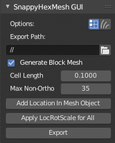
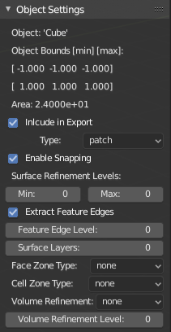

SnappyHexMesh GUI Addon for Blender
===================================

.. image:: images/shmg_example_and_panel.png

Introduction
------------

This add-on turns `Blender <https://www.blender.org>`_
into a GUI for SnappyHexMesh, a volume mesh generation tool for
OpenFOAM®, the open source CFD (computational fluid dynamics) toolbox.
The add-on exports a complete OpenFOAM case folder structure, with
geometry and dictionary files, ready to run OpenFOAM commands
including *snappyHexMesh*. The aim of the add-on is to

* Ease the workflow for importing, updating, modifying and exporting
  3D surface meshes to OpenFOAM.
* Allow definition of most common SnappyHexMesh settings via Blender
  GUI, to reduce need for manual modification of OpenFOAM dictionary
  definitions.
* Require minimal Blender skills. Geometry can be modelled in any 3D
  modelling / CAD program which exports a surface mesh format that can
  be imported to Blender, such as STL or Wavefront OBJ.

The add-on generates OpenFOAM dictionary files for the surface mesh
objects in Blender. Dictionary creation is based on string
replacements using template files located in the
add-on's *skel* directory. The add-on is meant to work on
latest LTS release of `Blender`_ and latest stable
`OpenFOAM Foundation <https://openfoam.org/>`_ version of OpenFOAM.
Tested with Blender 3.3 LTS and OpenFOAM 10.

Current Status and Features
---------------------------

Currently implemented features include:

* Creation of basic OpenFOAM case structure, including export of
  dictionary files (most importantly snappyHexMeshDict) and meshes as
  STL files
* Optional creation of definition file for hexahedral base volume mesh with
  a defined cell size (blockMeshDict)
* Calculation of cell count for block volume mesh
* Definition of Surface Refinement Levels for surface meshes
* Creation of Feature Edges definition file (surfaceFeaturesDict)
* Definition of Surface Layers per surface
* Calculation of minimum and maximum bounds and surface area for each mesh.
  These information are also written to snappyHexMeshDict as comments.
* Creation of Face Zones and Cell Zones from surface meshes
* Specification of Refinement Regions (Volumes)

Installation and Start-up
-------------------------

* It is suggested to use newest LTS version of Blender,
  `download Blender here <https://www.blender.org/download/>`_.
* Add-on code is available at https://github.com/tkeskita/snappyhexmesh_gui
  --> Code --> Download zip.
* Start Blender, go to "Edit" --> "Preferences" --> "Add-ons" --> "Install"
  --> open the add-on zip file.
* Activate the "SnappyHexMesh GUI" add-on in Preferences.
  Add-on is located in Object category of Blender add-ons.
* Click "Save Preferences" to autoload add-on every time Blender is started

Add-on visibility
-----------------

Add-on is visible in Blender's 3D Viewport in Sidebar as a separate
tab in Object Mode. To view the add-on panels, you must

  * Select a mesh object (in 3D Viewport or in Outliner)
  * View Sidebar ("View" --> "Toggle Sidebar" or press "N" key in 3D Viewport)
  * Select "SnappyHexMesh GUI" tab in the Sidebar

Quickstart
----------

* Create surface meshes in any suitable 3D modelling tool and export
  in STL/OBJ format
* Import meshes to Blender ("File" --> "Import")
  or model geometry directly in Blender
* Adjust the add-on settings per object in Blender
* Save Blender file to an empty case folder
* Click **Export** button in the add-on to create OpenFOAM directories
  and files under case folder

After export from Blender, you should be able to run following OpenFOAM
commands in case folder in order:

* ``blockMesh``
* ``surfaceFeatures`` (for openfoam.org version of OpenFOAM) or ``surfaceFeatureExtract`` (for openfoam.com version)
* ``snappyHexMesh``
* ``checkMesh``

You can view the final mesh using `Paraview <https://www.paraview.org>`_.

Iterative Workflow
------------------

Here is an example iterative workflow for working the whole mesh
creation pipeline in a case folder. Meshing and reviewing the results
is fastest when you start with a fairly large block mesh *Cell
Length*, and tune only a few settings in the GUI at a time.

* Clean up case folder by running **Clean Case Dir**, or commands in terminal: ``rm -rf 1 2 3 constant system``
* Make modifications in Blender, save file, and click the add-on **Export** button
* run OpenFOAM terminal commands: ``blockMesh; surfaceFeatures; snappyHexMesh``
* Refresh Paraview to see updated mesh

  
Panels and Settings
-------------------

SnappyHexMesh GUI consists of three main Panels: SnappyHexMesh GUI
(top panel), Object Settings (middle panel) and Export Summary (bottom
panel). By default all panels are expanded.

.. image:: images/shmg_ui.png

SnappyHexMesh GUI Panel
^^^^^^^^^^^^^^^^^^^^^^^

This panel contains overall settings and tool buttons.
You can hover mouse cursor over fields to see tool tips for more
information.

* *Options* with CPU count and two toggle icons:

  * *CPUs* specifies the number of cores for *decomposeParDict*
    (*scotch* decomposition method is the default for *decomposePar*)
  * Do Snapping Phase
  * Do Layer Addition Phase

* *Export Scale* is an optional scaling factor for STL geometry
  files and convertToMeters in blockMeshDict.
* *Fork* defines the fork of OpenFOAM for compatibility of generated files.
  Currently it only defines whether to produce *surfaceFeaturesDict*
  (for openfoam.org) or *surfaceFeatureExtractDict* (for
  openfoam.com).
* *Export path* defines path name where the add-on creates the OpenFOAM
  case files when the Export tool is run. The default value "//" means
  that the case folder is the same folder where Blender file is saved.
* *Generate Block Mesh* indicates that blockMeshDict is to be generated
  during export using *Cell Length* as a measure for cubical cell sides.
* *Cell Length* is the target length for the block mesh cube side,
  which will be created after export by running the OpenFOAM command
  *blockMesh*.
* *Max Non-Ortho* is the volume mesh quality measure for maximum
  non-orthogonality for SnappyHexMesh. **Note:** A small value
  produces mesh that is good for the numerical solution of flow
  equations, and a high value yields mesh that fits to surfaces better
  and allows better surface layer coverage (if layers are added).
* **Add Location In Mesh Object** will add an Empty object to Blender
  scene. The coordinates of this object is applied to specify the
  Location In Mesh for snappyHexMesh. If this object does not exist,
  zero coordinates are used for Location In Mesh.
* **Clean Case Dir** command removes directory names *1, 2, 3, constant* and
  *system* if they exist in the *Export path*. This effectively cleans
  up the case folder from any lingering OpenFOAM files, so that after
  running *Export*, the case folder should contain only fresh files,
  ready for OpenFOAM.
* **Apply LocRotScale For All** is a convenience tool for Blender
  modellers, which resets the Location, Rotation and Scale properties
  of all mesh objects to zero values. It is **not necessary** to run
  this tool to get correct location, rotation and scaling of the mesh
  in export. It is safe to ignore this tool, unless you use special
  Blender modelling features whose operation depends on object
  location, rotation and scale (e.g. Modifiers).
* **Export** tool creates and saves the OpenFOAM case files under
  *Export path* using the overall settings in this panel and Object
  Settings for each mesh object included in the export.
* If *ASCII STL* icon on right of *Export* tool is enabled, the STL
  files are written in ASCII text format instead of binary STL format.

Object Settings Panel
^^^^^^^^^^^^^^^^^^^^^

This panel shows settings for the active (selected) mesh object.

The panel top part shows information about the object. These
information are also added as comments in snappyHexMeshDict upon
export:
	   
* *Object* row shows the name of the active object.
* **Copy Settings to Objects** tool copies the SnappyHexMesh GUI
  settings from *the active object* to all *selected mesh
  objects*. This allows mass modification of SnappyHexMesh settings
  when dealing with numerous objects.
* *Object Bounds [min] [max]* shows the minimum and maximum
  coordinates of two box corners which span the volume included
  by the mesh object (bounding box).
* *Area* shows the summed surface area of all faces included in the
  object. **Warning:** Includes mesh errors, like overlapping faces, if
  there are any.

Rest of the panel includes object settings:

* *Include in Export* check box is used to mark which mesh objects are
  to be included in export.
* *Type* specifies the OpenFOAM patch type for this object.
* *Enable snapping* check box marks inclusion/exclusion of this object
  for SnappyHexMesh snapping phase.
* *Surface Refinement Levels*, *Min* and *Max* specify the minimum and
  maximum level of cell refinements made next to the surfaces of this
  object.
* *Extract Feature Edges* check box marks whether Feature Edges (sharp
  edges) are to be extracted into eMesh format from this object (done
  by running the *featureSurfaces* OpenFOAM utility). If Feature Edges
  are extracted, then they are also assumed to be included for Feature
  Edge Snapping in SnappyHexMesh.
* *Feature Edge Level* defines a separate cell refinement level for
  Feature Edges.
* *Surface Layers* specifies the number of surface layers that are to
  be added to surfaces of this object. Addition of surface layers also
  requires that the *Do Layer Addition Phase* option icon at top is
  activated.
* *Face Zone Type* decides the type of face zones that are to be
  created for surface:

  * none: No face zone or cell zone are to be created.
  * internal: Face zone is created with internal faces (each face
    is shared by two cells)
  * baffle: Face zone is created as baffles (overlapping unshared
    boundary faces).
  * boundary: Face zone is created as boundaries (unshared boundary
    faces).

  Note: Face zone name is same as object name.

* *Cell Zone Type* defines the type of cell zones in relation to
  surface mesh, which is assumed to define a manifold surface which
  closes a volume:

  * none: No cell zone is to be created.
  * inside: Inside of the closed volume is to be included in cell zone.
  * outside: Outside of the closed volume is to be included in cell zone.

  **Note:** Cell zone name is same as object name.
  
  **Note 2:** Cell zones requires face zones to be created as well.
    
* *Volume Refinement* specifies that some cells are to be refined accordingly:

  * none: No refinement.
  * inside: Cells inside of the closed volume are to be refined.
  * outside: Cells outside of the closed volume are to be refined.

* *Volume Refinement Level* shows the number of refinements for volume refinement.

Export Summary Panel
^^^^^^^^^^^^^^^^^^^^

This panel summarizes the overall properties of export.

.. image:: images/shmg_panel_summary.png

* *Global Bounds [min] [max]* shows the minimum and maximum
  coordinates of the bounding box for all mesh objects included in the
  export.
* *Block Mesh Count* is an estimate for the number of cubic cells in
  Block Mesh which covers the Global Bounds using cube side length
  specified in *Cell Length* parameter. Block Mesh will be created by
  running OpenFOAM command *blockMesh*.
* *Objects included* lists all the mesh objects in Blender file, which
  will be exported when *Export* tool is run.
  
Feedback
--------

`File bug report in github
<https://github.com/tkeskita/snappyhexmesh_gui/issues>`_

Example
-------

A vessel example is located in the add-on's *example* folder called
*vessel.blend*, which showcases some of the features.

.. figure:: images/example_geo.png

   Vessel geometry, wall, zone and refinement volumes in surface mesh format viewed in `Blender`_

.. figure:: images/example_mesh_result.png

   Resulting volume mesh from SnappyHexMesh viewed in `Paraview`_

FAQ
---

Q: Why is my inlet/outlet/other patch cells malformed / big / not created?

A: Your inlet/outlet/other patch does not coincide with (internal)
faces of the cells of the base block mesh. You may also need to apply
a sufficient level of refinement.

Q: Why build a SnappyHexMesh GUI on top of Blender?

A: Mainly because of Blender's GUI Python API, 3D Viewport and surface
mesh modelling tools. Blender has powerful tools for polygon surface
modelling and modification, and is suitable also for precision
modelling required by engineering/scientific applications, although
the learning curve to take advantage of all features is steep.

Q: How do I learn Blender?

A: See links at https://openfoamwiki.net/index.php/Blender

OpenFOAM Trade Mark Notice
--------------------------

This offering is not approved or endorsed by OpenCFD Limited, producer
and distributor of the OpenFOAM software via www.openfoam.com, and
owner of the OPENFOAM® and OpenCFD® trade marks.
